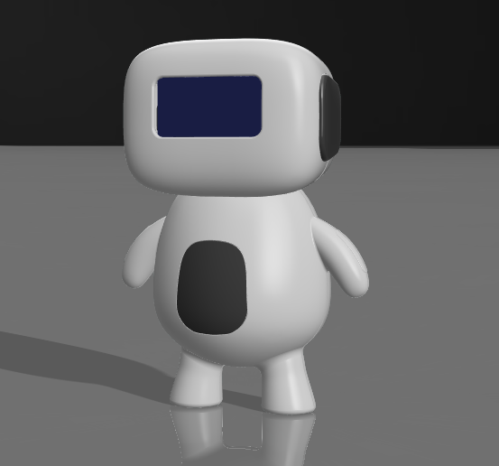

# Kipo Desktop Robot 

🤖 Kipo Desktop Robot

A cute, interactive desktop companion robot inspired by Dasai Mochi, built using an ESP32-C3 Super Mini. This robot combines touch interaction, audio output, and a display to create a fun and expressive experience.

✨ Features

👆 Touch Interaction
Head touch 
Belly touch

🔊 Audio Output
Uses MAX98357A I2S amplifier for clear digital audio
Plays sounds, voice, or simple expressions

🖥️ OLED Display
Displays emotions, animations, or status

🔋 Battery Powered
Powered by LiPo battery with onboard charging via TP4056

⚡ Compact Design
Built using ESP32-C3 Super Mini for low power and small form factor

| Component           | Description               |
| ------------------- | ------------------------- |
| ESP32-C3 Super Mini | Main microcontroller      |
| MAX98357A           | I2S Audio Amplifier       |
| Speaker             | Audio output              |
| OLED Display        | Visual feedback           |
| Touch Sensors (x2)  | User input (head & belly) |
| LiPo Battery        | Portable power            |
| TP4056              | Battery charging module   |

Code & Schematics

I uploaded the Code from [The mochi Huykhong](https://themochi.huykhong.com/) website. Also they provided schematic wiring 

⚠️ 3D Printing Note

🛠️ Important: This robot enclosure is designed to be printed in multiple parts.

The model should be split into separate objects before printing.

💡 Author

Gokul S
Robotics & Embedded Systems Enthusiast

